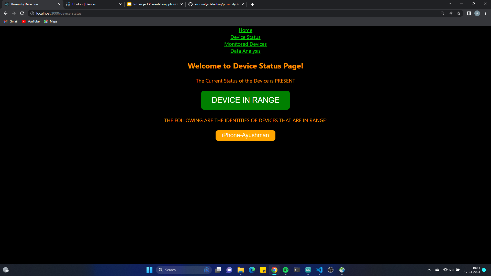
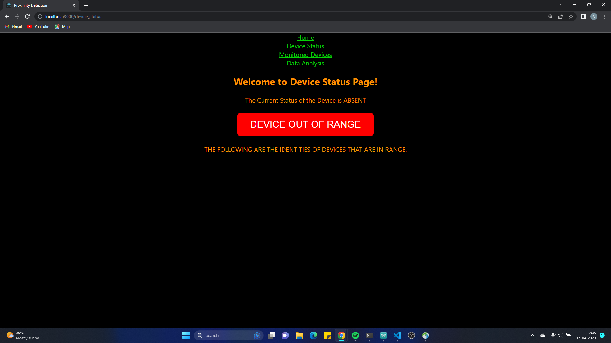
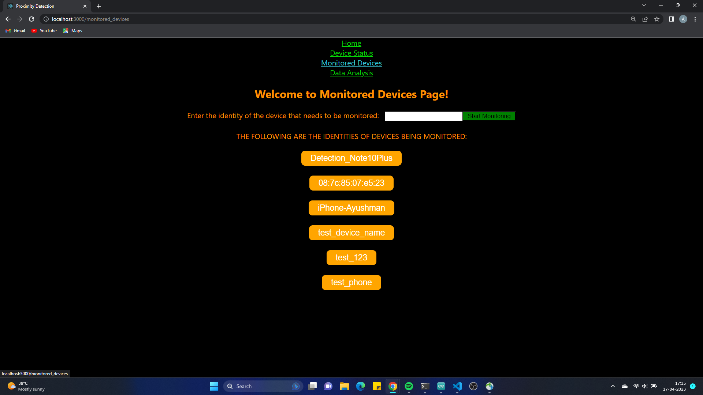
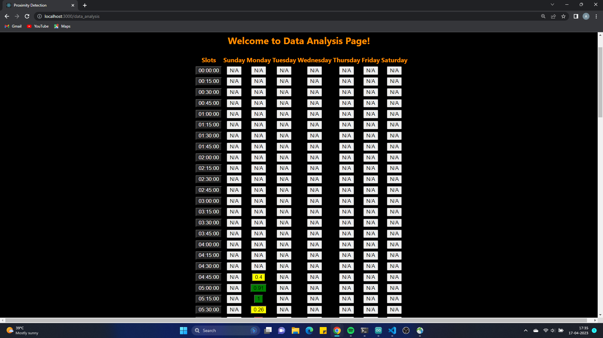
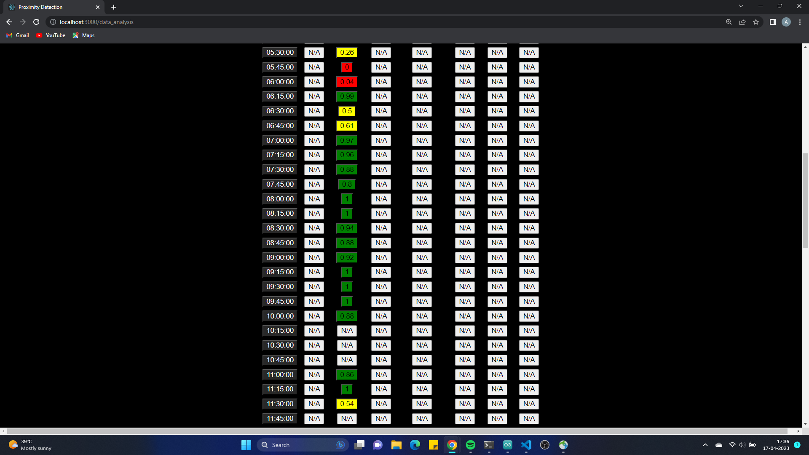

# Proximity Detection using BLE via ESP32

## Introduction
IoT devices have grown numerously over the past few years. The data generated by these can have a huge impact in all domains. BLE (Bluetooth Low Energy) is of dire importance to these devices as using BLE, the sensory IoT devices can transmit a small amount of data at lower speeds. 

The main aim of our project is to perform Proximity Detection using the BLE via ESP32, where any device of interest would be detected if it falls within a specified range of the ESP32 module by making use of the BLE of the smart device. Other than this, many more functionalities like **Data Analysis**, **Multi-Device Detection**, **Synchronous Detection of a device using Multiple ESP32 modules**, and more have been offered. We have developed a full stack application having a *ReactJS frontend*, *NodeJS backend* and a *MySQL database* for the same.

## Features
* **Proximity Detection of Smart Devices** within the threshold range of ESP32 module using BLE
    - The presence of the device is shown if the RSSI is greater than a threshold value
* Displaying the **device status** (presence/absence) both in Ubidots and our Application
    - Using different colors of an **LED** to show the sending of data to **Ubidots and Backend**
    - **All the devices in range are shown** in the frontend in the *Device Status* page
* **Multi-Device Monitoring** has been supported
    - Devices can be monitored by using their BLE MAC Address or their Device Name
    - The detection via Device Name was added because most devices randomize their BLE MAC Addresses
    - **User can add new devices under monitoring directly from the frontend** by simply adding the name/ble-mac-address
    - **All the devices being monitored are displayed** in the frontend in the *Monitored Devices* page
* **Data Analysis** of the collected data and displaying it with indicators
    - All the collected data is stored in the database in a novel manner according to time-slots
    - The *percentage presence of the device in a time-slot* is calculated and displayed
    - **Presence indicators** are used during presenting the data to the user
        - green: device was detected for more than 75%
        - yellow: device was detected between 25% to 75%
        - red: device was detected for less than 25%
    - Data is shown for each day, averaged over weeks in each time-slot
* Support for **Multiple ESP32 devices** in a synchronous manner
    - Muliple ESP32 devices can act synchronously to detect the device
    - The *synchronization* between these is done using the *common backend*
    - Correct updation of device presence even if only one ESP32 module detects the device both in Ubidots and Frontend
    - Functionality to support an **Interval for Retained Presence** (15 seconds for now) 
* **Full Stack Application** made to support all the functionalities
    - *ReactJS* for developing the Frontend
    - *NodeJS* for developing the Backend
    - *MySQL Database* for storing the data

## Working
The section below represents a workflow of the Project:

### **ESP32**

1. The ESP32 device first connects to the WiFi using the specified SSID and Password.
2. The initialization of the BLE Scanner is done and the scan parameters are set.
3. We override a callback function, named `BLEAdvertisedDeviceCallbacks()` of the class `MyAdvertisedDeviceCallbacks` where we put in the code for detection of the Smart Device. 
    - This callback function gets called, everytime a new device is detected by the ESP32 module.
    - It first compares the `deviceName` and `deviceAddress` with the list of known devices (defined below). 
    - If either of it matches, then it sets the value of variable `deviceFound[]` to be `true` for that device.
    - Then the `deviceRSSI` is compared with the `thresholdRSSI`, which if greater, then the variable `deviceInRange[]` is set to be `true` for that device.

- The following code runs in a loop:

4. A list of Strings is present, named `devicesOfInterest` which stores the identities of devices being monitored. This is initialized using an `HTTP GET` request to the backend implemented in the function `getMonitoredDevices()`.
5. The BLE Device Scan is started, where **detection of any BLE device triggers the callback function** with logic as defined above in step 3.
6. The boolean list `deviceInRange[]` is parsed to check for the devices detected by the scan that are in proximity and are added to a list `devicesFound[]`. Also a boolean `anyDeviceInRange` is set accordingly.
7. We then send the data (any device was detected or not, and the list of devices that were detected) to the Backend using an `HTTP POST` request. The *LED is set to BLUE* for the duration.
8. To ensure the *Synchronization of Multiple ESP32 modules and for Retained Presence Feature*, we perform an `HTTP GET` request to the backend to get the value of device status and store it in a variable named `currentDeviceStatus`.
9. We send the value of `currentDeviceStatus` and the id of the last detected device named `deviceId` to the Ubidots. During this interval, the *LED is set to RED*.

### **BACKEND**

We will discuss the various REST API Endpoints offered by the Backend.

The following are the GET request endpoints:

* `/current_status` : This endpoint is accessed by both the frontend to show the Current Device Status in the *Device Status* page and by the ESP32, before sending to Ubidots. It gets the value of user is present or not from the database table `user_detected`. 

* `/devices_found` : It is accessesed by the frontend while displaying the list of Devices Found in the *Device Status* page and returns the list of identities of devices in range, that was sent by the esp32 device after mapping the numbers to the identities.

* `/ble_mac` : It is accessed by the frontend while displaying the list of devices under observation in the *Monitored Devices* page. It fetches the list of known identities of devices which are known from the database table `ble_mac_addresses`.

* `/data_analysis` : This is accessed by the frontend while displaying the *Data Analysis* page. It gets the user presence data from the database table named `data_analysis`.

The following are the POST request endpoints:

* `/current_status` : This endpoint is accessed by the ESP32 to update the current status of the device and the list of found devices. 
    - When the device is detected by an ESP32 module, the `is_present` is set to `true` in the `user_detected` table and the `last_updated` timestamp is set to the current timestamp. 
    - When the device is not detected by an ESP32 module, the `last_updated` value is first fetched and checked in the backend. If the diffrence between *last updated timestamp* and the *current timestamp* is greater than 15 seconds, then only the value of `is_present` is set to `false`, else the value is discarded.
    - This conditional updating of the timestamp ensures *Synchronization between Multiple ESP32 modules* and also gives a time gap of 15 seconds to the user, where if it is not in the proximity of any of the ESP32 modules for any time interval less than or equal to 15 seconds, still the device status would be shown as present. Thus, the feature *Retained Presence* arises.

* `/update_mac_list` : This endpoint is accessed by the frontend when the user enters a new device identity to be monitored in the *Monitored Devices* page. It takes in the new value of device identity as given by the user and inserts it into the database table `ble_mac_addresses`.

### **FRONTEND** 

The following images depict the frontend:

#### DEVICE STATUS PAGE

The image on the left shows any device of interest in range and the one in the right shows the state when no device of interest is in range. 

 

<table>
    <tr>
        <td>  </td>
        <td>   </td>
    </tr>
</table>

 

#### MONITORED DEVICES PAGE

In this page, the user can enter the Identity (Name of Device or the BLE MAC Address) of the Device that is to be monitored. It also shows the list of devices that are currently being monitored by our ESP32 modules.

 

 
    

### DATA ANALYSIS PAGE

In this page, we show the Data Analysis of the device presence data as collected by the ESP32 devices and stored in the Database. The week is divided into weekdays and each day has 15 min time-intervals. The number corresponding to the time-slot in the day represents the degree of presence of the device in that time-stamp. As you can see that colored indicators represent the degree of presence (green for greater than 75%, yellow for between 25% and 75%, and red for less than 25%).

 

<table>
    <tr>
        <td>  </td>
        <td>   </td>
    </tr>
</table>